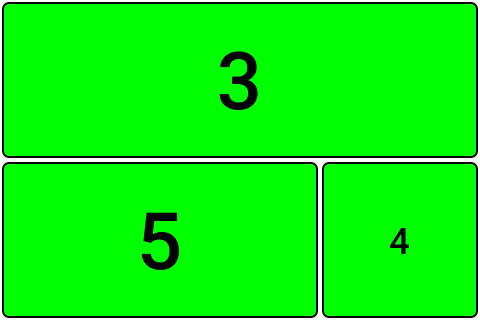

# Dynamic interface
A dynamic interface build on top of lvgl.

This interface features:
   * A tiling layout system allowing for a very wide range of layouts.
   * Widgets for the brewblox blox aswell as some breblox agnostic widgets.
   * Configpanel support for some widgets where touching the widget opens a configpanel for onsite changes.
   * Widgets scale the available space they are given.
   * Serialisation and deserialisation of the layout and widgets to a protobuf stream.

## Layout elements
Before widgets can be placed on the screen a layout must be defined so the widgets have a place and size in respect to each other. To do this multiple layout elements excist which are composed in a tree to form a layout.

### Screen element
The screen element is the top of the tree. This element represents the display in which all the other elements will be drawn. The screen element can hold one element as a child.

### Content element
A content element is a placeholder for content. This can be any type of widget. The content element does not know anything about its size of position. This is defered from it's parents. For instance if the content element has the screen as its parent the widget will be drawn fullscreen.

### Vertical split & horizontal split
Vertical splits and horizontal splits are used to be able to draw widgets next to eachother in different sizes. A split contains a set of other elements which will be positioned horizontaly or verticaly. Each of those elements must have a weight. When the weight of alle elements is the same all those elements will be spread evenly over the row or collum. If the weights differ the blocks will be drawn to ratio of their weight against the sum of all weights.

An example, a horizontalsplit is defined with two element with element A having a weight of 1 and element B with a weight of 2. When drawing this layout, the sum of all weights is taken, in this case 1+2=3. Then the elements are drawn against their ratio. So for element A it's 1/3 of the size of the screen and for element B it's 2/3.

## Widgets
Widgets can be paired to the content elements by the ID of the content elements. Widgets will scale to the size of the content element. If widget grows larger the amount of detail will increase. The following widgets are currently included:

### Color Widget
The color widget displays a single color. This is mostly for testing.

### Empty widget
The empty widget is a color widget with a grey color. This widget is special in that it won't show up when the tree is serialised. When a content element has no paired widget this widget will be paired automaticly.

### Numeric value widget
The numeric value widget represent a single number. This is the base for showing different sensor data.

## Configpanels
TBA

## Updating values
TBA

## Fonts
For the dynamic interface fixed with fonts are used. Because each character has a fixed width, the width of a string becomes more predictable.

## Scaling
A widget will always scale to the content node its paired to. This amount of detail shown will also grow with the size given to a widget. Nametags can, for example, only be shown when a label of 10 digits can be shown.

## Serialisation & deserialisation
The dynamic interface can be serialised and deserialised using protobuf. To represent the tree of layoutnodes with paired widgets two table like structures are used.

### Layout nodes
The first structure is the layoutnodes. Each layout node is defined as a layoutID, parentID, type and weight. The layoutID is the id of the node itself and the parentID points to the parent of this particulair node in the tree. To allow for correct decoding the guarntee must be made that the layoutID of a node must always be greater than the parentID. The screennode is not included in the layoutnodes but is defined as layoutID 0. The highest node in the structure must have 0 as its parentid.

An example:



This example can be defined as:
| **LayoutID** | **ParentID** | **Type**         | **Weight** |
|--------------|--------------|------------------|------------|
| 1            | 0            | Horizontal split | 1          |
| 2            | 1            | Vertical split   | 1          |
| 3            | 1            | Content          | 1          |
| 4            | 2            | Content          | 1          |
| 5            | 2            | Content          | 2          |

You can also think of the layoutNodes as a tree:

```
Screen: 0
└──Horizontal split: 1
   │  Content: 3
   └──Vertical Split : 2
         Content: 4
         Content: 5
```

### Widgets
For each widgets a protobuf spec excists. They go into a contentNode where a oneof defines the type of widget. Common to all widgets is that they include a layoutNodeID which coresponts with a content layoutNode in which the widget must be drawn.
## Test screen
A test screen is included so that some example widgets can be drawn on the screen without the need of a server. The testscreen lives in `util/test_screen.hpp`.

## Unit tests
The tests for this interface live in `$gitRoot/test/gui`. To run the test, navigate to the scripts folder and run `./test.sh gui`.

## Documentation
Docs are included as doxygen in the header files aswell as in the various `README.md`s.
